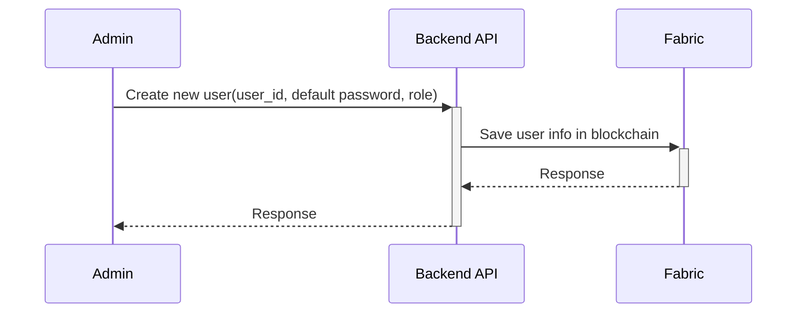
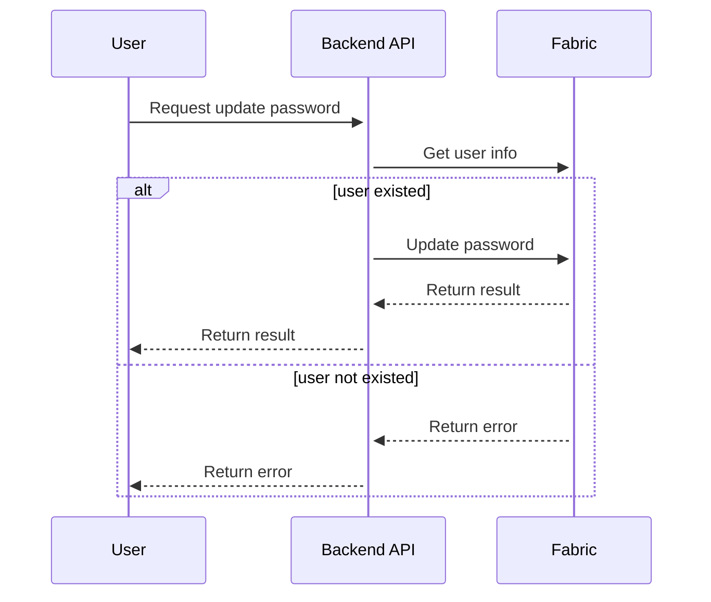
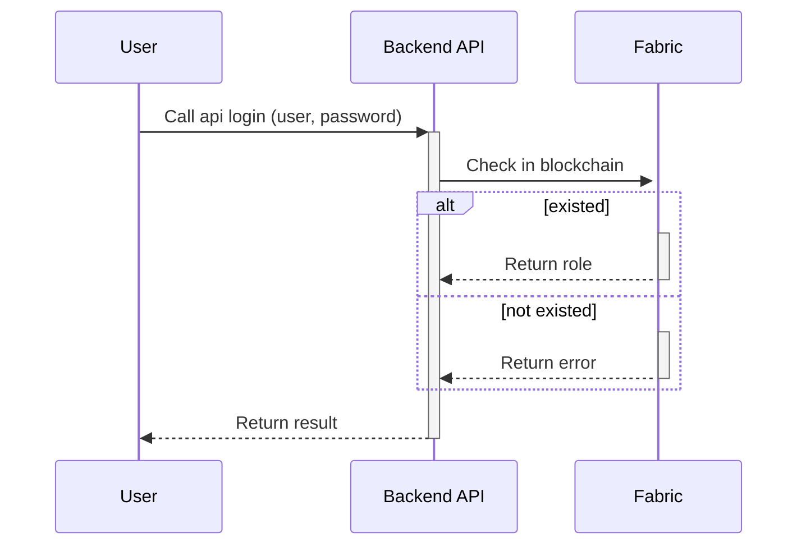

### Hướng tiếp cận demo:
**Kiểm soát truy cập:**
Blockchain có thể được sử dụng để xác thực người dùng và cấp quyền truy cập vào dữ liệu SCADA. Điều này có thể giúp bảo vệ dữ liệu khỏi bị truy cập trái phép.

- Trong một hệ thống SCADA truyền thống, kiểm soát truy cập được thực hiện thông qua một cơ sở dữ liệu tập trung. Cơ sở dữ liệu này lưu trữ thông tin đăng nhập của tất cả người dùng được phép truy cập vào hệ thống. Khi người dùng muốn truy cập hệ thống, họ sẽ phải đăng nhập bằng thông tin đăng nhập của mình.

- Tuy nhiên, mô hình này có một số nhược điểm. Thứ nhất, cơ sở dữ liệu tập trung có thể là mục tiêu của các cuộc tấn công mạng. Nếu kẻ tấn công có thể truy cập vào cơ sở dữ liệu này, họ có thể lấy cắp thông tin đăng nhập của tất cả người dùng và truy cập trái phép vào hệ thống.Thứ hai, cơ sở dữ liệu tập trung có thể không được bảo mật. Nếu kẻ tấn công có thể thay đổi dữ liệu trong cơ sở dữ liệu, họ có thể cấp quyền truy cập trái phép cho người dùng hoặc thay đổi dữ liệu SCADA.

- Blockchain có thể được sử dụng để cải thiện kiểm soát truy cập cho các hệ thống SCADA. Trong một hệ thống SCADA sử dụng blockchain, thông tin đăng nhập của người dùng sẽ được lưu trữ trong các khối blockchain. Các khối này được lưu trữ trên một mạng lưới phân tán, do đó chúng không thể bị thay đổi hoặc xóa mà không có sự đồng thuận của tất cả các nút trong mạng lưới.Điều này làm cho việc tấn công mạng vào hệ thống kiểm soát truy cập trở nên khó khăn hơn nhiều. Kẻ tấn công sẽ phải tấn công tất cả các nút trong mạng lưới để có thể thay đổi dữ liệu trong blockchain.

- Mặt khác, blockchain cũng có thể giúp tăng cường tính minh bạch của quá trình kiểm soát truy cập. Tất cả các hoạt động kiểm soát truy cập, chẳng hạn như cấp quyền truy cập, thu hồi quyền truy cập và thay đổi thông tin đăng nhập, sẽ được ghi lại trong blockchain. Điều này giúp các bên liên quan có thể dễ dàng theo dõi hoạt động của hệ thống và xác minh rằng chỉ những người dùng được phép mới có thể truy cập vào hệ thống.

### Demo
**Đặt vấn đề:**  Một hệ thống SCADA cho phép quản lý một nhà máy điện. Hệ thống này cần lưu trữ thông tin đăng nhập của các nhân viên vận hành. Thay vì phương pháp truyền thống lưu trữ dữ liệu trên những cơ sở dữ liệu tập chung, chúng ta sẽ lưu thông tin đăng nhập của các nhân viên vận hành vào Fabric. Một `smart contract` được viết để quản lý những thông tin đăng nhập (`username`, `password`, `role`). Khi một nhân viên vận hành được thêm mới vào hệ thống đồng thời sẽ được thêm vào sổ cái. `Smart-contract` sẽ xác thực `user` thông qua `username`, `password` (đã hash). Nếu `user` được xác thực hệ thống sẽ trả về `role`.

Các chức năng của `smart contract`:
- Thêm `user`
- Xác thực `user`
- Lấy dữ liệu `role` của `user`
- Lấy lịch sử truy cập của `user` (cân nhắc thêm - lấy bằng cách quét qua tất cả các transaction)

**Tạo user:**

**User cập nhật mật khẩu:**

**Đăng nhập**

Các bước thực hiện:
- [ ] Viết `smart-contract` có chức năng:
    - [ ] `createUser(user_id, password, role)`
    - [ ] `updatePassword(user_id, old_password, new_password)`
    - [ ] `login(user_id, password)`
- [ ] Viết `BackendAPI` với các api tương ứng với `smart-contract`:
    - [ ] '/create-user' (POST)
    - [ ] '/update-password' (PUT)
    - [ ] '/login' (POST)
- [ ] Viết một app demo sử dụng `flutter` về việc đăng nhập, thay đổi mật khẩu, lấy lịch sử truy cập
    - [ ] Giao diện (Đăng nhập, thêm user, đổi mật khẩu, lịch sử truy cập)
    - [ ] Xử lý gọi api
    